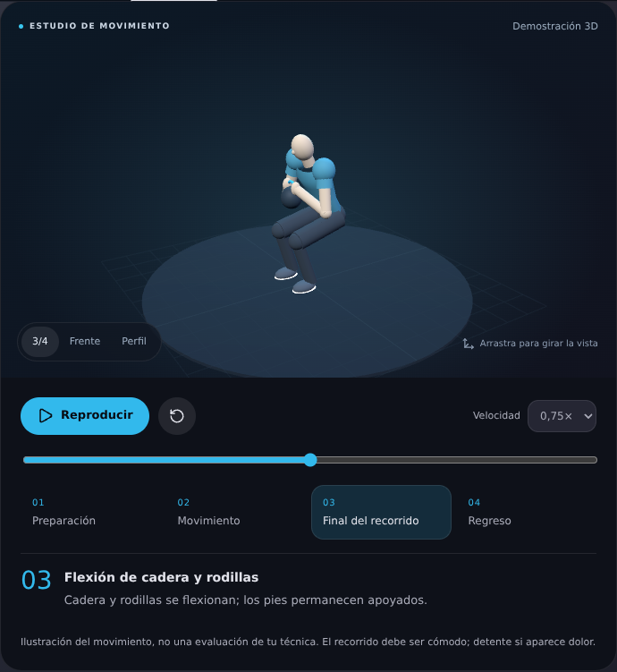

# Entreno Astra

Entrenador personal para un solo usuario: entrenamientos, alimentación y progreso en
el mismo sitio, sin login ni backend propio, pensado para integrarse como panel
personalizado (`panel_custom`) de Home Assistant.

- `src/App.jsx` — estado, pantallas e integración con Home Assistant.
- `build.mjs` — cadena de construcción (esbuild), única para las dos fases.
- `dist/index.html` — fase 1: página autónoma con el bundle incrustado (se abre en
  cualquier navegador o como artifact).
- `dist/panel.js` — fase 2: módulo ES autocontenido para `config/www/entrenador/`.
- `docs/PLAN.md` — modelo de datos, mapa de pantallas, algoritmo de cargas y estética.

## Construir

```bash
npm install
npm run build      # genera dist/panel.js y dist/index.html
npm run dev        # lo mismo, reconstruyendo al guardar
```

Sin dependencias de CDN en tiempo de ejecución: Preact, los iconos y las gráficas
(SVG propio) y el visor 3D van dentro del módulo. No descarga modelos ni vídeos al abrir un ejercicio.

## Interfaz Astra

Rediseño inspirado en las capturas del dashboard de Home Assistant: fondo oscuro
con luces azules y violetas, superficies translúcidas con borde suave, iconos
circulares, controles en pastilla y navegación superior subrayada. Incluye acceso
directo a Ajustes y composición adaptable a móvil y escritorio.

`src/appearance.js` contiene la capa visual y sus tokens, incrustada junto con
los estilos base de `src/App.jsx` en el módulo final. No requiere hojas de estilo,
fuentes ni imágenes remotas. Las variables de Home Assistant siguen controlando
los colores; `--entreno-background` permite sustituir los degradados por el fondo
del dashboard. Las transparencias tienen alternativa opaca y se respeta la
preferencia de movimiento reducido.

Para instalar esta copia, utiliza **GitZurb/EntrenoAstra** como repositorio
personalizado de HACS. El módulo compilado sigue siendo `dist/panel.js`.
Para instalación manual, copia ese módulo a tu carpeta de HA y actualiza la URL
con `?v=0.6.0`. Esta edición usa el mismo elemento `entreno-panel`: carga una sola
versión del módulo en cada dashboard. El cambio visual no migra datos ni cambia
las entidades configuradas.

## Fase 1 · aplicación autónoma

Abre `dist/index.html`. Los datos viven en IndexedDB del navegador (exportación e
importación JSON completa en Ajustes → Datos). Arranca vacío de registros: solo
trae material de referencia (60 ejercicios con técnica e ilustración, tres
plantillas de rutina, una tabla de alimentos y el programa de 26 semanas). Las
sesiones, las comidas, el peso y las recetas los creas tú. Fuera de Home Assistant `hass` es nulo y la
integración queda inactiva; la pantalla de Ajustes → Home Assistant ya está
construida y se rellena con entidades reales cuando el panel corre dentro de HA.

## Programa de 26 semanas

`SEED_PROGRAM` en `src/App.jsx` define seis meses de entrenamiento en cinco
bloques —Calibración y base, Acumulación, Fuerza escalonada, Densidad, y Pico y
test— sobre cinco días fijos de la semana: **lunes push, martes pull, miércoles
full body de fuerza, viernes torso mixto y domingo full body metabólico**
(`dayOffsets: [0, 1, 2, 4, 6]`). Jueves y sábado son de descanso activo.

La semana 1 es de **calibración**: el plan no trae kilos escritos. Se busca el
peso que deje 3 repeticiones en recámara y de ahí sale la progresión, que es
escalonada y siempre dentro de las cargas realmente montables con el material
del usuario: saltos de 3 kg en barra (20 · 23 · 26 · 30 …) y una escalera
mucho más basta en mancuernas (5 · 12 · 15 · 22 · 25 · 32 · 35 por mancuerna,
porque los discos van de cuatro en cuatro). Cuando el escalón que toca es de
7 kg, se progresa con repeticiones y series en vez de forzar el salto.

Los modificadores por semana (`MODS_BASE`, `MODS_6`, `MODS_TEST`) añaden series
y bajan el RIR dentro de cada bloque, con descarga en la última semana de los
bloques largos. El motor (`programPlanFor`, `programStatus`) calcula el plan
concreto de cada semana y el estado de las 130 sesiones; una sesión no hecha se
desplaza o se salta desde la vista Programa. Restricciones incorporadas: rodilla
sensible (pierna por tempo, pausas y unilateral, no por kilos), sin ayudante
(empuje pesado con mancuernas y press de suelo), sesiones de ~60 min y déficit
calórico por fases.

Desde la vista Programa, **Publicar** vuelca las 130 sesiones al calendario de
Home Assistant como eventos de día completo, con los ejercicios y el RIR
objetivo del día en la descripción.

## Demostraciones de ejercicios · 0.6.0

El visor sustituye los pictogramas que alternaban dos imágenes por una figura 3D
articulada, vestida y con el material del ejercicio. Los 61 ejercicios del catálogo
incluyen una demostración y explicaciones del patrón de movimiento. Los isométricos
muestran una postura fija, con información sobre apoyos y respiración.

- Reproducir, pausar, reiniciar y cambiar la velocidad de la demostración.
- Barra de posición y selección de preparación, movimiento, final y regreso.
- Cámara giratoria mediante arrastre y vistas frontal, de perfil y tres cuartos.
- Inicio en pausa, movimiento reducido y suspensión al ocultar la ficha.
- Miniaturas vectoriales sin WebGL en las listas; alternativa vectorial si el
  dispositivo no puede crear la escena 3D.

`src/exercise-motion.js` contiene el catálogo, los tiempos y las explicaciones;
`src/exercise-kinematics.js`, los movimientos y apoyos de las extremidades;
`src/exercise-scene.js`, la escena propia con Three.js;
`src/exercise-player.jsx` y su CSS, los controles. El movimiento es una ilustración
procedural, no una captura de movimiento ni una evaluación de la técnica del usuario.

Three.js se incluye en el módulo y no requiere servicios, modelos ni vídeos externos.
El visor 3D requiere WebGL2. Las gráficas del resto de la app siguen siendo SVG.

**Instalación:** utiliza `dist/panel.js` mediante HACS o archivo local, actualizando
la URL a `?v=0.6.0` cuando corresponda. El recurso comprimido supera ahora el límite
aproximado de 128 kB de la alternativa en línea: no pegues `dist/resource.js` como
una URI de datos. `dist/index.html` sigue funcionando como página autónoma.

### Verificación del visor

`npm run test:motion` comprueba cobertura, coordenadas finitas, continuidad,
proporciones de la figura, apoyos y posturas estáticas. Se han abierto las 61
fichas en Chromium y probado los controles, movimiento reducido y la alternativa
sin WebGL. Diseño revisado a 320, 768 y 1280 px. La técnica deportiva no ha sido
validada por un profesional; tampoco se ha probado en la instancia real de HA.



## Fase 2 · panel de Home Assistant

El mismo bundle `dist/panel.js` se copia a `config/www/entrenador/panel.js` y se
registra con `panel_custom` (`embed_iframe: false`). El elemento `<entreno-panel>`
implementa los setters `hass`, `narrow`, `route` y `panel`. Los ficheros de
`config/www` se sirven con caché agresiva: versiona la URL del módulo
(`/local/entrenador/panel.js?v=X.Y.Z`) en cada actualización.

Instalado con HACS como repositorio personalizado, con el dashboard «Entreno» y
los cinco helpers creados. Guía completa y estado: `docs/HOME_ASSISTANT.md`.
Fragmentos listos para copiar: `docs/ha/configuration.yaml` y `docs/ha/input_number.yaml`.
